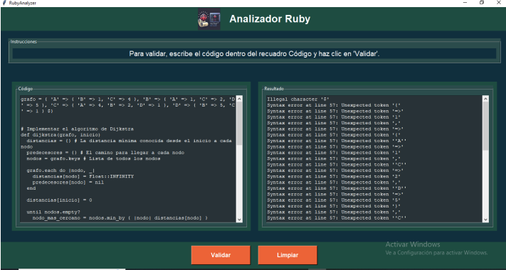

# Mi Sitio Personal

¡Bienvenido a mi repositorio personal! Aquí encontrarás información sobre mí, mis proyectos, intereses y más.

---

## Contenido
- [Información Personal](#información-personal)
- [Proyectos](#proyectos)
- [Intereses](#intereses)

---

## Información Personal
- **Nombre:** José Miguel Delgado  
- **Ocupación:** Estudiante  
- **Lugar de residencia:** Ecuador  

---

## Proyectos

### [AutoSell](https://github.com/paixram/AutoSell#)
- **Descripción:** Un sistema automatizado para la gestión de ventas.  
- **Tecnologías utilizadas:** Java  
- **Estado:** ✅ Completado
- **Capturas de pantalla:**  
 
 

### [LPPET ](https://github.com/xHianx/LPPET/blob/main/backend/backend.py)
- **Descripción:** Aplicación para hacer gestión de adopciones de mascotas.  
- **Tecnologías utilizadas:** Flask, MySQL, JSON, Dart.  
- **Capturas de pantalla:**  
  

### [ProyectoLP](https://github.com/xHianx/ProyectoLP)
- **Descripción:** Desarrollo de una herramienta para validar el léxico, la sintaxis y la semántica del lenguaje de programación Ruby.   
- **Tecnologías utilizadas:**Ruby, Python
- **Estado:** ✅ Completado  
- **Capturas de pantalla:**  

---

## Intereses
- Desarrollo web y móvil.  
- Inteligencia artificial y aprendizaje automático.  
- Diseño de interfaces de usuario (UI/UX).  

## Tecnologías y Herramientas Aprendidas

Durante el curso, he adquirido conocimientos en diversas tecnologías, herramientas, frameworks y librerías que he aplicado en mis proyectos:

### Lenguajes de Programación
- 
- 
- 
- 
- 
- 
- 
- 

### Frameworks y Librerías
- **Flask**: Framework ligero de Python para el desarrollo de aplicaciones web.

- **Pandas**: Librería de Python para el análisis y manipulación de datos.
- **NumPy**: Librería de Python para el cálculo numérico y análisis de datos.
- **JSON**: Formato de intercambio de datos utilizado para enviar y recibir información entre el cliente y el servidor.

### Herramientas
- **Git y GitHub**: Para el control de versiones y colaboración en proyectos.
- **Visual Studio Code**: IDE principal para el desarrollo de proyectos.
- **Postman**: Herramienta para probar y documentar APIs.

- **Figma**: Utilizado para el diseño de interfaces y prototipos de aplicaciones.

